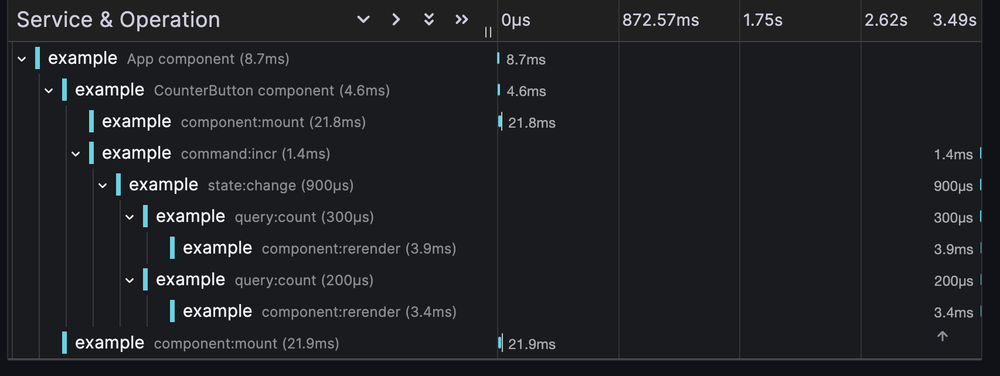

# React + EffectTS

This is a simple example of how to use EffectTS with React.

- [x] User behavior and component rerender are tracked with spans
- [x] CQRS-based state management
- [ ] Async data fetching with React Suspense

## Effect state

```tsx
import { component, dispatcher, getter, render, state } from "effect-react";
import { Effect } from "effect";

const Counter = component(
  "Counter",
  Effect.gen(function* () {
    const count = yield* state(0);
    const get = yield* getter;
    const dispatch = yield* dispatcher;
    return yield* render(() => (
      <div>
        Counter: {get(count.value)}
        <button onClick={() => dispatch(count.update((n) => n + 1))}>
          Increment
        </button>
      </div>
    ));
  })
);
```

## Effect domain

```tsx
import { Domain } from "effect-react";

const CounterDomain = Domain.make("counter", () =>
  Effect.gen(function* () {
    const count = yield* Domain.state(0);

    return {
      query: {
        count: count.value.pipe(Effect.map((v) => v * 2)),
      },
      command: {
        incr: (i: number) => Domain.set(count, (v) => v + i),
        decr: (i: number) => Domain.set(count, (v) => v - i),
      },
    };
  })
);
```

### An effect component using the domain

```tsx
const CounterButton = component(
  "CounterButton",
  Effect.gen(function* () {
    const domain = yield* CounterDomain.tag;
    const get = yield* getter;
    const dispatch = yield* dispatcher;
    return yield* render(() => (
      <button
        onClick={() => {
          dispatch(domain.command.incr(1));
        }}
      >
        {get(domain.query.count)}
      </button>
    ));
  })
);

const App = component(
  "App",
  Effect.gen(function* () {
    const domain = yield* CounterDomain.tag;
    const get = yield* getter;
    const Counter = yield* CounterButton.component;
    return yield* render(() => <div>Counter: {get(domain.query.count)} </div>);
  }).pipe(Effect.provide(CounterDomain.layer))
);
```

## Mount the root component

```tsx
import { mount } from "effect-react";
import { Effect, ManagedRuntime } from "effect";
import { createRoot } from "react-dom/client";
import { App } from "./App.tsx";

const runtime = ManagedRuntime.make(TraceLive);

runtime.runFork(
  Effect.gen(function* () {
    const root = createRoot(document.getElementById("root")!);
    yield* mount(App.component, (Root) => {
      root.render(<Root />);
    });
  })
);
```

## Enable tracing with Effect

### Start local docker container

```sh
cd ./docker/local
docker compose up
```

### Effect with span

```tsx
import { Effect } from "effect";

const CounterButton = component(
  "CounterButton",
  Effect.gen(function* () {
    const domain = yield* CounterDomain.tag;
    const get = yield* getter;
    const dispatch = yield* dispatcher;
    return yield* render(() => (
      <button
        onClick={() => {
          dispatch(domain.command.incr(1)).pipe(
            Effect.withSpan("click incr button")
          );
        }}
      >
        {get(domain.query.count)}
      </button>
    ));
  })
);
```


